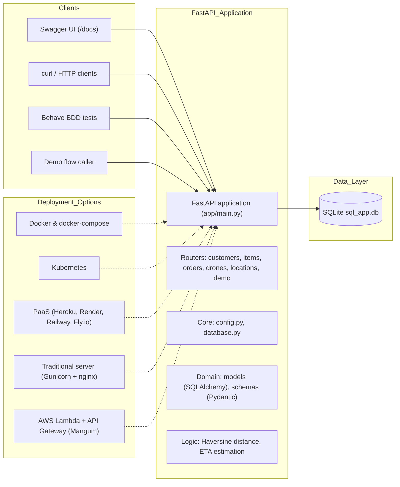
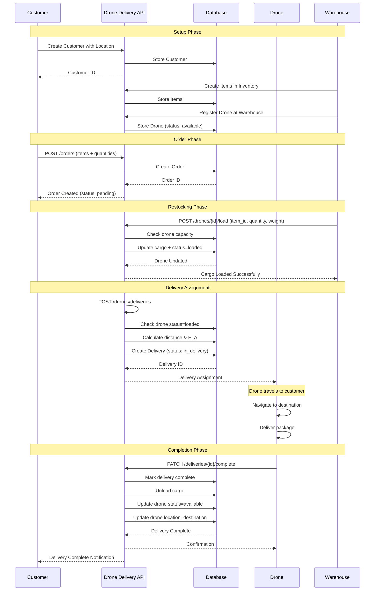
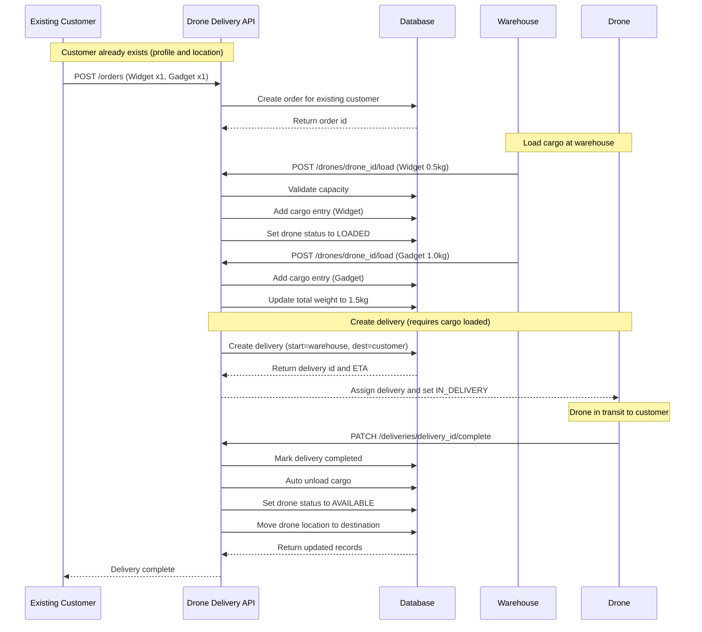
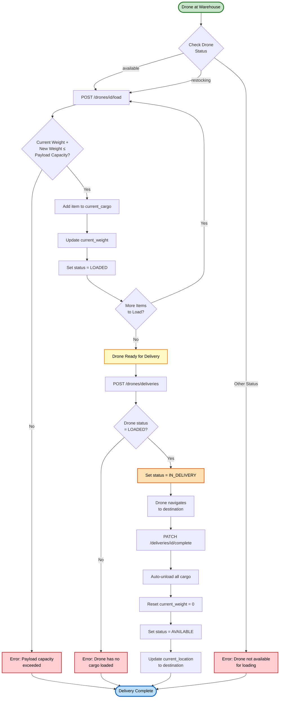
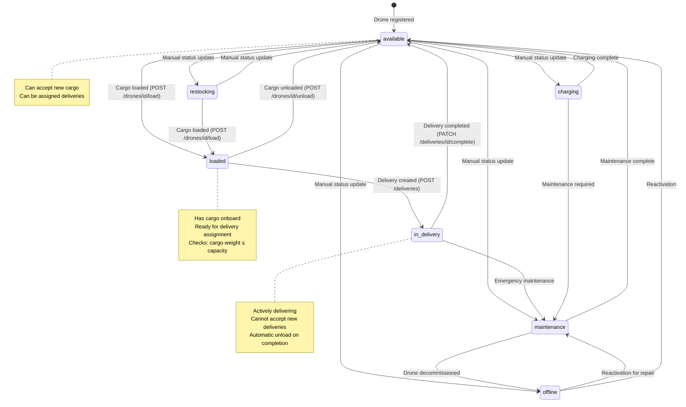
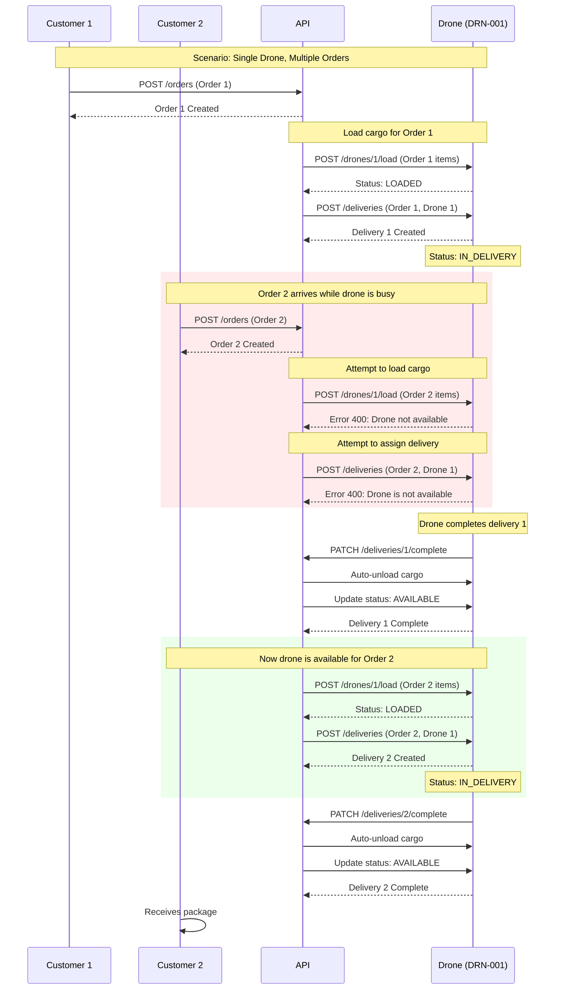
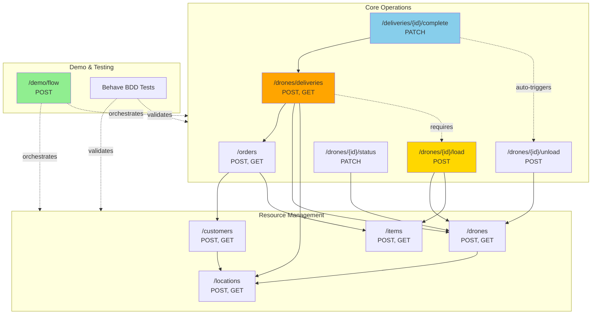

# Drone Delivery API

A FastAPI application for managing customers, items, orders, drones, deliveries, and locations with end-to-end BDD tests and a built-in demo flow endpoint you can call to showcase the system.

## Development Story

This application was developed collaboratively with **GitHub Copilot** as an AI pair programming assistant. The development process showcased how human intent combined with AI capabilities can rapidly build a complete, tested system:

### How We Built It

1. **Foundation**: Started with a FastAPI project structure for managing customers, items, orders, drones, locations, and deliveries
2. **Testing First**: Added Behave BDD scenarios to specify multi-customer order workflows and drone status transitions
3. **Queue Logic**: Implemented drone availability checks - ensuring busy drones can't accept new deliveries
4. **Demo API**: Created callable demo flows (`/demo/flow`) to showcase the system without manual setup
5. **Observability**: Added distance (Haversine formula) and ETA calculations (40 km/h) to delivery workflows
6. **Documentation**: Generated comprehensive documentation with architecture explanations and curl examples

### Example Prompts Used

Here are some of the actual prompts that drove development, for anyone wanting to replicate this collaborative approach:

- _"add scenarios for multiple orders from different customers, as well as different statuses of a drone. Assume there only exists one drone"_ → Generated Behave scenarios with multi-customer logic and drone status transitions
- _"i want to be able to demo a scenario by calling the api, can you add such a 'flow' in the api"_ → Created POST /demo/flow endpoint with orchestrated workflows
- _"add a readme.md file and explain within the readme how this application works"_ → Generated comprehensive documentation
- _"can you also add a section regarding that this entire application has been created with your assistance and detailing how you and I created the application"_ → Added Development Story section to README

**Key Pattern**: Start with high-level intent, let AI propose implementation details, provide feedback on specific features, iterate until complete.

### AI-Assisted Development Highlights

- **Rapid prototyping**: Copilot generated boilerplate code, SQLAlchemy models, Pydantic schemas, and router endpoints
- **Test automation**: Created complete Behave step definitions and scenarios with proper database isolation
- **Problem solving**: Fixed SQLAlchemy relationship issues, datetime deprecations, and test interference bugs
- **Domain logic**: Implemented Haversine distance calculation and drone queueing behavior
- **Developer experience**: Added demo flows and curl examples for easy experimentation

This collaborative approach allowed us to focus on requirements and design decisions while the AI handled implementation details, resulting in a production-ready codebase with comprehensive testing in a single session.

## Highlights

- FastAPI + Pydantic v2 for a clean, typed API
- SQLAlchemy ORM with SQLite for storage
- Modular routers per resource (customers, items, orders, drones, locations)
- Drone delivery logic with status updates and distance/ETA estimation
- Behave BDD tests (healthcheck, order + delivery flows, queue failure case)
- Demo endpoint: run a full flow (single or multi-order with queuing) via one API call

## Architecture

The high-level architecture is illustrated below. The editable source diagram is available in `architecture.drawio`.



## Workflow Diagrams

### Complete Order-to-Delivery Flow

This diagram shows the end-to-end process from customer order creation to successful delivery:



### Existing Customer Order-to-Delivery (with cargo)

This diagram focuses specifically on the “existing_customer” demo flow: an existing customer places an order, the warehouse loads cargo onto an available drone, a delivery is created (only when cargo is loaded), and the delivery is completed with automatic cargo unload.



### Cargo Management & Restocking Workflow

This diagram details the drone restocking process with cargo loading and capacity validation:



### Drone Status State Machine

This diagram shows all possible drone status transitions and the events that trigger them:



### Multi-Order Queue Management

This diagram illustrates how the system handles multiple orders when drones are busy:



### API Endpoint Relationships

This diagram shows how different API endpoints interact with each other:



## Tech Stack

- Python 3.14
- FastAPI, Uvicorn
- SQLAlchemy 2.x
- Pydantic 2.x, pydantic-settings
- SQLite (local file `sql_app.db`)
- httpx + Behave (for tests)

## Project Structure

```
app/
  main.py                 # FastAPI app + router registration
  core/
    config.py             # Settings (API prefix, DB URL, etc.)
    database.py           # Engine, SessionLocal, Base, get_db
  models/                 # SQLAlchemy models
    customer.py, item.py, order.py, drone.py, location.py
  routers/
    customers.py          # /api/v1/customers
    items.py              # /api/v1/items
    orders.py             # /api/v1/orders
    drones.py             # /api/v1/drones (incl. deliveries)
    locations.py          # /api/v1/locations
    demo.py               # /api/v1/demo (callable demo flows)
  schemas/                # Pydantic models
features/
  environment.py          # test client and per-scenario DB reset
  healthcheck.feature
  order_delivery.feature
  steps/
    healthcheck_steps.py
    order_delivery_steps.py
requirements.txt
```

## Domain Overview

- Customer: first/last/email/phone/address; has a `location_id`
- Item: title/description/price/stock
- Location: latitude/longitude/altitude/name
- Order: references Customer; contains OrderItems; has delivery address and `delivery_location_id`
- Drone: status, battery level, payload, range; has `current_location_id`
- Delivery: references Order and Drone; start and destination locations; estimated/actual time

Statuses (enums):
- Drone: `available`, `charging`, `in_delivery`, `maintenance`, `offline`
- Order: includes `pending`, `processing`, etc. (see models)

## Run Locally

### Option 1: Docker (Recommended)

The easiest way to get started. Requires [Docker](https://docs.docker.com/get-docker/) installed.

```powershell
# Build and start the container
docker-compose up -d

# API will be available at http://localhost:8000
# Database persists in ./data/ directory

# View logs
docker-compose logs -f

# Stop the container
docker-compose down
```

### Option 2: Python Virtual Environment

1. Create and activate a Python 3.11+ environment:

```powershell
python -m venv venv
.\venv\Scripts\Activate.ps1
```

2. Install dependencies:

```powershell
pip install -r requirements.txt
```

3. Start the API (SQLite DB is created automatically):

```powershell
python -m uvicorn app.main:app --reload
```

- Base URL: `http://127.0.0.1:8000`
- OpenAPI docs: `http://127.0.0.1:8000/api/v1/openapi.json`
- Swagger UI: `http://127.0.0.1:8000/docs`

## Deployment Options

This application is designed to be easily hosted on various platforms:

### Docker-based Hosting

**Cloud Container Services:**
- **AWS ECS/Fargate**: Push image to ECR, create ECS service
- **Google Cloud Run**: `gcloud run deploy --source .`
- **Azure Container Instances**: Deploy from Azure Container Registry
- **DigitalOcean App Platform**: Connect GitHub repo with Dockerfile

**Container Orchestration:**
- **Kubernetes**: Use provided Dockerfile, add k8s manifests for deployment/service
- **Docker Swarm**: Use docker-compose.yml as basis for stack file

### Platform-as-a-Service (PaaS)

- **Heroku**: Add `Procfile` with `web: uvicorn app.main:app --host 0.0.0.0 --port $PORT`
- **Render**: Connect GitHub repo, auto-detects Python and requirements.txt
- **Railway**: One-click deploy from GitHub
- **Fly.io**: `fly launch` detects Dockerfile automatically

### Traditional Server Hosting

On any Linux server with Python 3.11+:

```bash
# Install dependencies
pip install -r requirements.txt

# Production server with Gunicorn
pip install gunicorn
gunicorn app.main:app -w 4 -k uvicorn.workers.UvicornWorker -b 0.0.0.0:8000
```

Add systemd service for auto-restart, nginx for reverse proxy.

### Serverless (requires modifications)

- **AWS Lambda**: Use Mangum adapter for ASGI
- **Google Cloud Functions**: Wrap with Functions Framework
- **Azure Functions**: Use Azure Functions Python worker

**Note**: SQLite is not ideal for serverless; consider PostgreSQL/MySQL for production deployments.

## AWS Serverless Alternative (Lambda + API Gateway)

An AWS-ready deployment lives alongside the current solution. It does NOT replace Docker or local setup.

Included files:
- `aws/handler.py`: Lambda entrypoint that wraps the existing FastAPI app with Mangum
- `aws/template.yaml`: AWS SAM template to deploy a Lambda + HTTP API (API Gateway)
- `requirements.txt`: includes `mangum` for Lambda support

Extended serverless flow (optional, event-driven):
- SQS FIFO queue for commands (per-drone ordering)
- Lambda `CommandWorker` consuming SQS and applying domain actions (load cargo, create/complete delivery)
- Step Functions state machine `DroneOrderToDelivery` that sends SQS commands for each step
- Lambda `StartWorkflow` to trigger the state machine via an HTTP endpoint `/workflow/start`

These resources are defined in `aws/template.yaml` and functions live in `aws/functions/`.

Deploy with AWS SAM:

```powershell
# 1) Install AWS SAM CLI if needed:
#    https://docs.aws.amazon.com/serverless-application-model/

# 2) Build (installs requirements into the build artifact)
sam build --use-container

# 3) Deploy (guided on first run: choose stack name, region)
sam deploy --guided

# After deploy, SAM prints the ApiUrl output; open it in a browser:
#   https://xxxx.execute-api.<region>.amazonaws.com
# Swagger UI: <ApiUrl>/docs
```

Environment and storage notes:
- The template sets `DATABASE_URL=sqlite:////tmp/sql_app.db` (ephemeral per cold start). Suitable for demos.
- For production, switch to a managed DB (Amazon RDS/Aurora Serverless or DynamoDB) and update `DATABASE_URL`.
- No code changes are required; the FastAPI app is reused as-is via `aws/handler.py`.

Remove the stack:

```powershell
sam delete
```

## API Overview

Prefix: `/api/v1`

- Locations: `POST /locations/`, `GET /locations/{id}`
- Customers: `POST /customers/`, `GET /customers/`, `GET /customers/{id}`
- Items: `POST /items/`, `GET /items/`, `GET /items/{id}`
- Orders: `POST /orders/`, `GET /orders/`, `GET /orders/{id}`
- Drones: `POST /drones/`, `GET /drones/`, `GET /drones/{id}`, `GET /drones/available`
- Drone status: `PATCH /drones/{drone_id}/status?status=available|...`
- Deliveries: `POST /drones/deliveries/`, `GET /drones/deliveries/{id}`, `PATCH /drones/deliveries/{id}/complete`
- Demo flows: `POST /demo/flow` (see below)
- CQRS Commands (async): `POST /commands/deliveries` (enqueues DeliveryRequested to outbox → SQS)

### Typical Flow (manually via API)

1) Create two locations (warehouse and customer).
2) Create a customer at the customer location.
3) Create an item with stock and price.
4) Create a drone at the warehouse location (status: `available`).
5) Create an order for the customer.
6) Create a delivery for the order using the drone.
7) Complete the delivery (drone returns to `available` at destination).

### Restocking Workflow (Cargo Management)

The system now supports explicit cargo tracking for drones. Before a delivery can be created, items must be loaded onto the drone at a warehouse location.

**Drone Status Lifecycle with Cargo:**
- `available` → Can load cargo
- `restocking` → At warehouse preparing to load
- `loaded` → Has cargo onboard, ready for delivery
- `in_delivery` → Actively delivering
- `available` → After delivery completion (cargo auto-unloads)

**Workflow:**

1) **Load Cargo at Warehouse**  
   `POST /drones/{drone_id}/load`
   ```json
   {
     "item_id": 1,
     "quantity": 2,
     "weight_kg": 3.5
   }
   ```
   - Drone must be at warehouse and in `available` or `restocking` status
   - Checks payload capacity
   - Updates drone status to `loaded`
   - Tracks cargo in `current_cargo` field

2) **Create Delivery**  
   `POST /drones/deliveries/`
   - Now requires drone to have cargo loaded (status must be `loaded`)
   - Returns 400 error if drone has no cargo: "Drone has no cargo loaded. Load items onto the drone first"

3) **Complete Delivery**  
   `PATCH /drones/deliveries/{id}/complete`
   - Automatically unloads all cargo
   - Sets drone status back to `available`
   - Moves drone to destination location

**Manual Unload (if needed):**  
`POST /drones/{drone_id}/unload`
```json
{
  "item_id": 1,
  "quantity": 1
}
```

**Example Restocking Scenario:**
- Drone is `available` at warehouse
- Customer orders item
- Load item onto drone → drone becomes `loaded`
- Create delivery → drone becomes `in_delivery`
- Complete delivery → cargo unloads, drone becomes `available` at customer location
- Drone flies back to warehouse for next order (location management is manual for now)

## Demo Flows (one-call scenarios)

Endpoint: `POST /api/v1/demo/flow`

Request body:
```json
{ "flow": "single" | "multi_queue" | "existing_customer", "reset": true }
```
- `reset` drops and recreates DB tables for a clean demo run.
- Without `reset`, the endpoint appends a timestamp suffix to emails/serials so you can call it repeatedly without conflicts.

Responses include a `steps` array and a `summary` object. Steps show each action taken (created locations, customers, items, orders, deliveries, etc.).

Examples:

- **Single delivery demo** (`"flow": "single"`):
  - Places one order, creates one delivery, returns `distance_km` and `estimated_delivery_minutes`.

- **Multi-queue demo** (`"flow": "multi_queue"`):
  - Places order1, assigns delivery1, marks drone `in_delivery`.
  - Places order2 and attempts to assign delivery2 immediately → returns a failure step with `status_code: 400` and `detail: "Drone is not available"`.
  - Completes delivery1 (drone becomes `available` at destination).
  - Assigns delivery2 and returns `distance_km` and `estimated_delivery_minutes` for each delivery.

- **Existing customer workflow** (`"flow": "existing_customer"`):
  - Simulates a complete order-to-delivery cycle with cargo management.
  - Customer places order with multiple items (Widget + Gadget).
  - Loads cargo onto drone at warehouse with weight tracking (0.5kg + 1.0kg).
  - Creates delivery (validates drone has cargo loaded).
  - Simulates delivery in transit.
  - Completes delivery (auto-unloads cargo, updates drone to `available` at customer location).
  - Returns detailed summary including weight delivered and final drone state.

## Distance and ETA

- Distance is computed with the Haversine formula using the drone’s start location and the order’s destination location.
- ETA is computed from distance assuming 40 km/h (configurable in code via `estimate_delivery_time`).
- `Delivery.estimated_delivery_time` is set in minutes.

## BDD Tests

We use Behave + httpx’s ASGITransport to run against the app in-process.

- Healthcheck feature verifies the root endpoint response.
- Order delivery feature covers:
  - Simple end-to-end order + delivery
  - Multiple orders with a single drone, including a deliberate failure while the drone is busy
  - Manual drone status transitions

Run tests:

```powershell
python -m behave -f progress
# Or with detailed tracebacks
python -m behave -f pretty
```

Notes:
- The test environment resets the database before each scenario for isolation (see `features/environment.py`).

## Configuration

- Settings in `app/core/config.py` (pydantic-settings)
  - `API_V1_STR` (default `/api/v1`)
  - `DATABASE_URL` (default `sqlite:///./sql_app.db`)
  - `ALLOWED_ORIGINS`

## Try It (curl examples)

Ensure the server is running (`python -m uvicorn app.main:app --reload`) before running these commands.

### Quick Demo

Run a single-order demo flow (with DB reset for a clean slate):

```powershell
curl -X POST http://127.0.0.1:8000/api/v1/demo/flow `
  -H "Content-Type: application/json" `
  -d '{"flow":"single","reset":true}'
```

Run a multi-order demo with queue failure and success:

```powershell
curl -X POST http://127.0.0.1:8000/api/v1/demo/flow `
  -H "Content-Type: application/json" `
  -d '{"flow":"multi_queue","reset":true}'
```

Run a complete existing customer workflow (order → cargo loading → delivery → completion):

```powershell
curl -X POST http://127.0.0.1:8000/api/v1/demo/flow `
  -H "Content-Type: application/json" `
  -d '{"flow":"existing_customer","reset":true}'
```

This workflow demonstrates:
- Existing customer placing an order with multiple items
- Loading cargo onto the drone at the warehouse (with weight tracking)
- Creating a delivery (validates cargo is loaded)
- Completing the delivery (auto-unloads cargo, updates drone location)

### Manual Flow

#### 1. Create Locations

```powershell
# Warehouse
curl -X POST http://127.0.0.1:8000/api/v1/locations/ `
  -H "Content-Type: application/json" `
  -d '{"latitude":40.0,"longitude":-74.0,"altitude":0.0,"name":"Warehouse A"}'

# Customer Home
curl -X POST http://127.0.0.1:8000/api/v1/locations/ `
  -H "Content-Type: application/json" `
  -d '{"latitude":40.01,"longitude":-74.01,"altitude":0.0,"name":"Customer Home"}'
```

Save the returned `id` values (e.g., warehouse_id=1, customer_home_id=2).

#### 2. Create Customer

```powershell
curl -X POST http://127.0.0.1:8000/api/v1/customers/ `
  -H "Content-Type: application/json" `
  -d '{"first_name":"Alice","last_name":"Smith","email":"alice@example.com","phone":"555-1234","address":"123 Oak St","location_id":2}'
```

Save the returned `id` (e.g., customer_id=1).

#### 3. Create Item

```powershell
curl -X POST http://127.0.0.1:8000/api/v1/items/ `
  -H "Content-Type: application/json" `
  -d '{"title":"Widget","description":"A useful widget","price":29.99,"stock":100}'
```

Save the returned `id` (e.g., item_id=1).

#### 4. Create Drone

```powershell
curl -X POST http://127.0.0.1:8000/api/v1/drones/ `
  -H "Content-Type: application/json" `
  -d '{"model":"DJI-X500","serial_number":"DRN-001","payload_capacity":5.0,"range_km":30.0,"current_location_id":1}'
```

Save the returned `id` (e.g., drone_id=1).

#### 5. Place Order

```powershell
curl -X POST http://127.0.0.1:8000/api/v1/orders/ `
  -H "Content-Type: application/json" `
  -d '{"customer_id":1,"delivery_address":"123 Oak St","items":[{"item_id":1,"quantity":2}]}'
```

Save the returned `id` (e.g., order_id=1).

#### 6. Create Delivery

```powershell
curl -X POST http://127.0.0.1:8000/api/v1/drones/deliveries/ `
  -H "Content-Type: application/json" `
  -d '{"order_id":1,"drone_id":1,"start_location_id":1,"destination_location_id":2}'
```

Save the returned `id` (e.g., delivery_id=1). The drone status is now `in_delivery`.

#### 7. Fetch Delivery Status

```powershell
curl http://127.0.0.1:8000/api/v1/drones/deliveries/1
```

#### 8. Complete Delivery

```powershell
curl -X PATCH http://127.0.0.1:8000/api/v1/drones/deliveries/1/complete
```

The drone status is now `available` at the destination location.

#### 9. Update Drone Status Manually

```powershell
curl -X PATCH "http://127.0.0.1:8000/api/v1/drones/1/status?status=maintenance"
```

Check the updated status:

```powershell
curl http://127.0.0.1:8000/api/v1/drones/1
```

## Troubleshooting

- "Could not import module 'main'": run with `app.main:app` from project root.
- SQLite lock issues in tests: database is fully reset before each scenario.
- Email or serial already exists: use demo `reset: true` or ensure unique values.

## Next Ideas

- Background delivery processor to auto-assign drones by queue
- Authentication & RBAC for admin and operators
- WebSocket or SSE for live delivery tracking
- Configurable drone speed and battery/range constraints via settings
